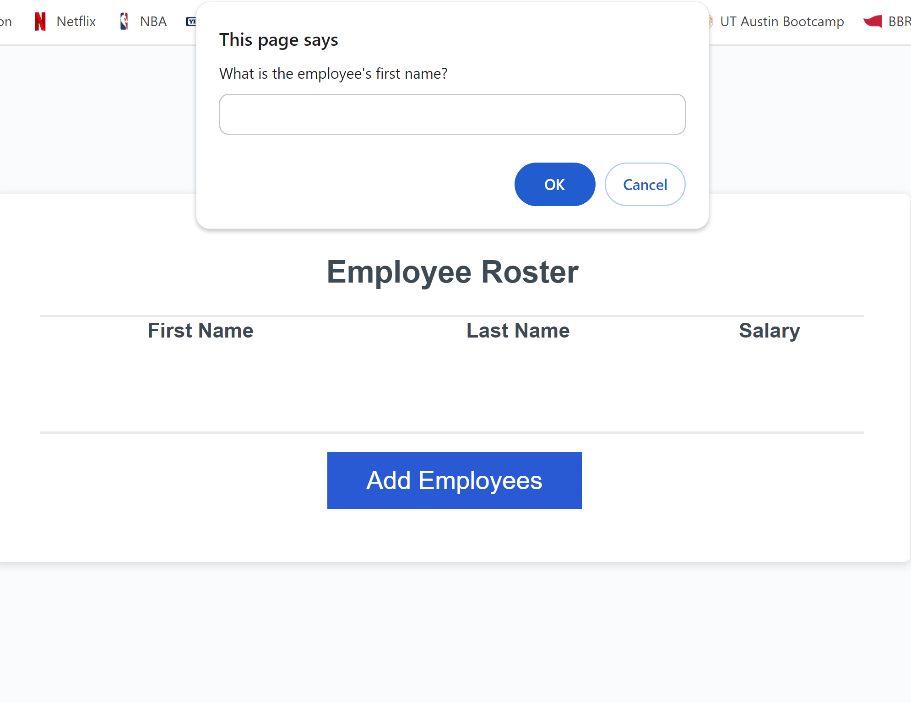
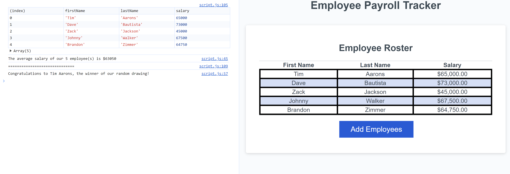

# payroll-tracker

## Description
This application can be used to organize and track employee data. 
It creates a table with each employee's first name, last name, and salary.
Employees will be listed alphabetically by last name and average salary for 
all employees will be calculated from this data. This can make it easy for 
business owners to quickly assess and manage their budget.

## Usage

To create a table, click the Add Employees button. You will be presented with a
series of prompts. Input the employees First Name, Last Name, and Salary. Any salary
input that is not a number will default to $0. After you enter the data, you will be
asked if you want to add another employee. Select OK or Cancel to proceed. 

Opening the console will allow you to see the average salary of all employees listed, and
the name of an employee that is picked at random.

## Website Link

https://bewtaich.github.io/payroll-tracker/

## License
Refer to MIT License within the repository

